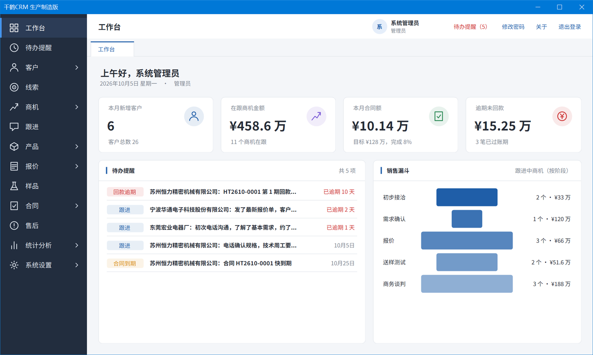
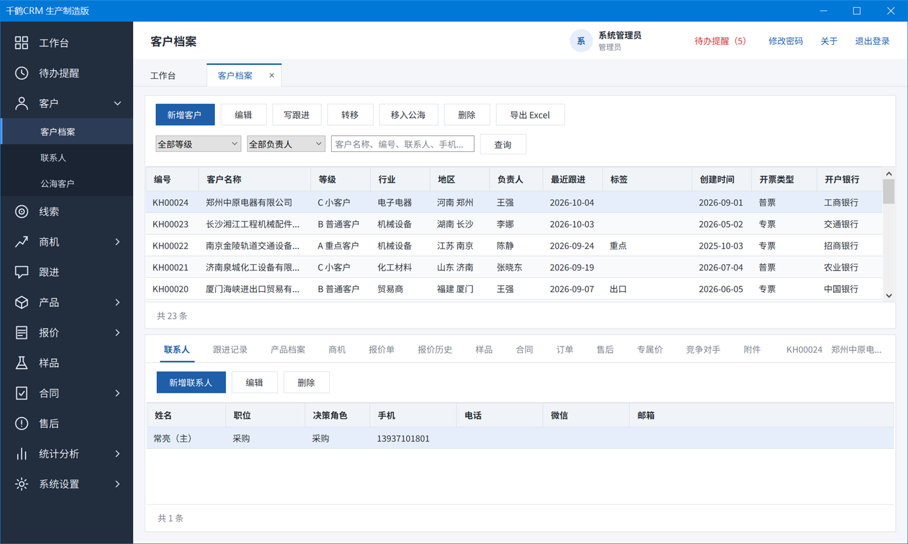
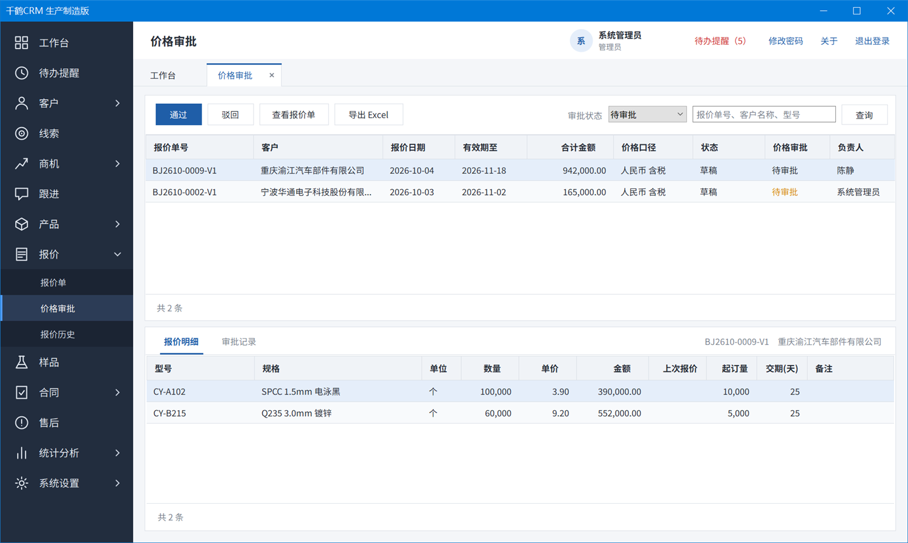
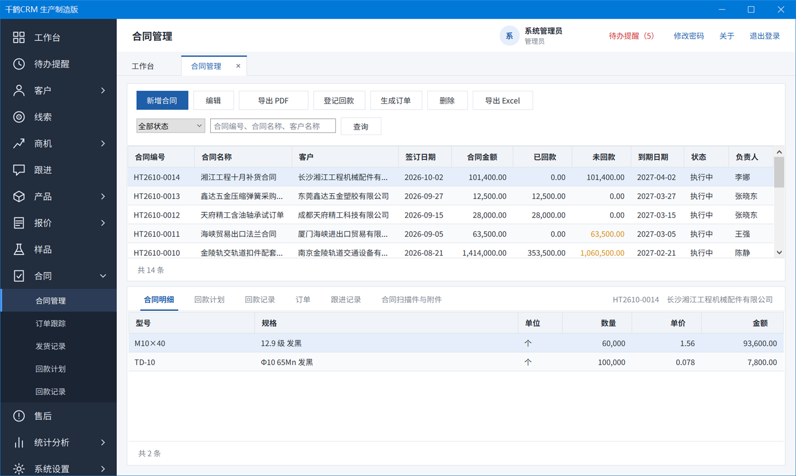
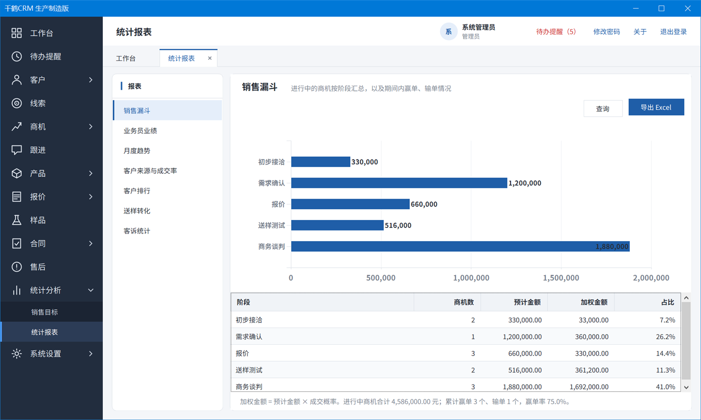

# 千鹤CRM 生产制造版

面向生产制造企业销售部门的单机客户管理软件。在一台电脑上管理客户、报价、样品、合同、发货与回款，数据保存在本机，无需服务器，也无需联网。

产品介绍页：https://design-k2.github.io/qianhecrm_sc/



## 下载

当前版本 1.0.0。

下载渠道：

1. [123 网盘](https://1838860709.share.123pan.cn/123pan/u00GTd-Vy2ad)
2. [微软 OneDrive](https://1drv.ms/f/c/B9800037B3890E00/IgCnmx_VlgRMS78LgMM50P1YAetEV6fvsBYorOo61fWa4zE?e=WGa3kF)
3. 本仓库直接下载（见下表）

| 文件 | 说明 | 大小 |
| --- | --- | --- |
| [QianheCRM_1.0.0_Setup.exe](downloads/QianheCRM_1.0.0_Setup.exe) | 安装程序（推荐）。数据保存在 `C:\ProgramData\QianheCRM` | 26 MB |
| [QianheCRM_1.0.0_Portable.zip](downloads/QianheCRM_1.0.0_Portable.zip) | 绿色版。解压后直接运行，数据保存在解压后的文件夹内 | 26 MB |
| [QianheCRM_Manual.pdf](downloads/QianheCRM_Manual.pdf) | 使用说明，共 18 章 | 11 MB |

文件校验值（SHA256）：

```
1F32D7F5ADE2419D5F1D856432DCC8DFBFABEFA3DD32D63B91C3CE1EAF2F2660  QianheCRM_1.0.0_Setup.exe
B99B422785D5C858C3A4DBB7F934A326ADB9AEEEEB787E5930B04C99F2DE6A81  QianheCRM_1.0.0_Portable.zip
```

安装程序暂未进行代码签名，运行时 Windows 可能显示安全提示。请核对校验值后，选择“更多信息”并继续运行。

## 主要功能

- **线索**：登记潜在客户，按公司名称和手机号查重，确认有效后转为正式客户。
- **客户**：联系人、跟进记录、报价、样品、合同、订单、售后集中在同一份客户档案下；支持公海客户。
- **报价**：单价按客户专属价、上次报价、标准价依次带出；低于底价自动进入审批；报价版本完整留存；可导出 PDF。
- **样品**：登记送样与测试反馈，未通过时改样重送，超期未反馈自动提醒。
- **合同与订单**：报价单可直接转为合同；按合同生成订单并分批登记发货；合同可导出 PDF。
- **回款**：按期数生成回款计划，逐笔登记回款，逾期款项自动提醒。
- **售后**：登记客诉的类型、批号、责任部门、原因与处理结果。
- **统计分析**：销售目标及七张统计报表，均可导出为 Excel。
- **系统管理**：角色权限与数据范围、数据字典、编号规则、自定义字段、Excel 批量导入、备份恢复、操作日志。

## 界面预览

客户档案：联系人、跟进、报价、合同等信息集中在同一页面。



价格审批：报价低于底价时自动进入审批。



合同管理：合同金额、已回款、未回款一目了然。



统计报表：销售漏斗、业务员业绩、月度趋势等七张报表。



## 运行环境

- Windows 7 SP1、Windows 8 / 8.1、Windows 10、Windows 11，32 位或 64 位
- .NET Framework 4.8（Windows 10 1903 及以上版本和 Windows 11 已内置）
- 分辨率不低于 1366 × 768

当前版本为单机版，数据保存在安装软件的那一台电脑上，暂不支持多台电脑共享同一份数据。

## 联系方式

如需咨询或反馈问题，请添加微信：NameFix，或在本仓库的 Issues 中留言。

## 版权与许可

© 2026 千鹤软件（常州）有限公司 版权所有。

本软件为专有软件，本仓库仅提供软件包、使用说明及产品介绍，不包含源代码。软件的使用须遵守安装程序中所附的《用户许可协议》。

软件中使用的第三方组件及其许可见 [THIRD-PARTY-NOTICES.md](THIRD-PARTY-NOTICES.md)。